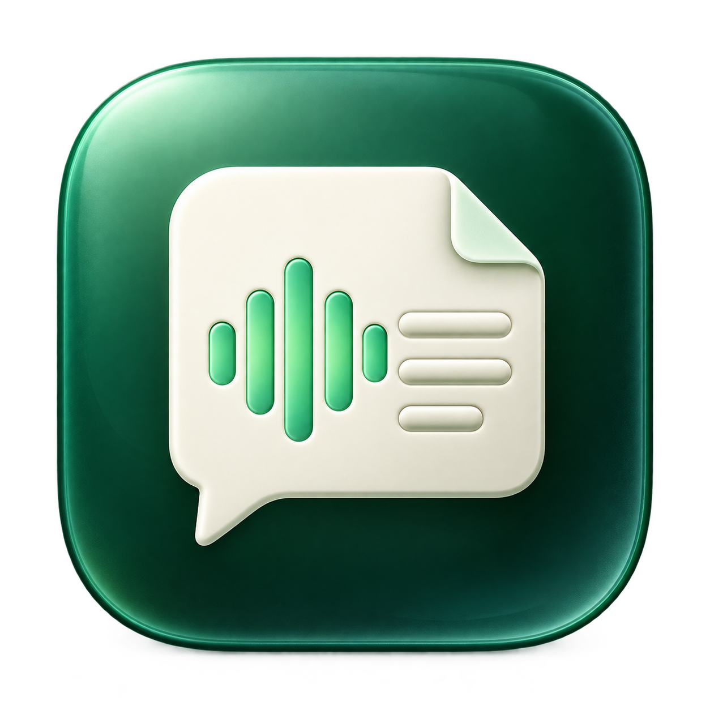

# LocalTranscribe



Turn audio and video recordings into text on your Mac. LocalTranscribe uses Whisper locally, with a native Mac window, a recording queue, and resumable processing for large files.

**Free for noncommercial use.** No transcription subscription or API key. Source is available under the [PolyForm Noncommercial License 1.0.0](LICENSE); commercial use and commercial resale are not permitted by that license. Noncommercial sharing and modifications are allowed with the required notices.

## Set up for your computer

Choose [AI-assisted setup](#ai-assisted-setup-optional) for help configuring your computer, or follow the [standard setup](#standard-setup) yourself. The current release supports **Apple Silicon Macs with macOS 14 or later**. Intel Macs, Windows, and Linux require additional backend/native-app work.

### AI-assisted setup (optional)

1. Download or clone this GitHub repository into a local folder.
2. Open that folder in a coding assistant with access to files and a terminal **on the computer where you will run the app**. Providing only the GitHub URL to a cloud chat does not give it access to your machine.
3. Paste this prompt:

```text
Set up LocalTranscribe for this computer. Check its CPU architecture, OS version,
available RAM, disk space, and installed dependencies. Follow the repository's
setup and build instructions. Choose a compatible local Whisper model and suitable
settings, making only the changes needed for this computer.

Keep machine-specific settings in ignored local files. Do not commit personal
names, home paths, hardware inventories, model downloads, logs, or recordings.
Preserve the license and required notices, and keep existing recordings and
transcripts intact. Use local inference without a paid API or recording uploads.

Run the existing small checks and verify the app opens. Do not process recordings
or start performance experiments unless I request them. If this computer is not
supported, explain the required porting work before modifying the app.
```

AI assistance is optional; the standard setup below works without a coding assistant. Keep any local customization private unless you intentionally prepare and review a contribution.

## Standard setup

Requirements:

- An Apple Silicon Mac with macOS 14 or later.
- [Homebrew](https://brew.sh), `uv`, and FFmpeg.
- Xcode Command Line Tools for building the native window.
- Several GB of free disk space for the isolated Python runtime and model.
- An internet connection for initial dependency/model downloads. Transcription then runs offline.

Install the prerequisites if needed:

```sh
brew install uv ffmpeg
xcode-select --install
```

Download or clone this repository, then run setup from its folder:

```sh
git clone https://github.com/prwerewolf/LocalTranscribe.git
cd LocalTranscribe
./setup.command
open LocalTranscribe.app
```

You can also double-click `setup.command` in Finder. Setup creates a project-local Python environment, installs the pinned dependencies, downloads the pinned public model, and builds the native app. It does not install a Codex skill or change global Git/Python settings.

Keep `LocalTranscribe.app` in this project folder. It uses the adjacent runtime, model, and source files. It is a local source build, not a standalone, notarized download.

## Transcribe

1. Add files or a folder, or drag recordings into the app.
2. Select the recordings you want to process.
3. Choose the output folder.
4. Press **Transcribe selected**.

Nothing starts automatically. **Stop** preserves completed checkpoints. Select a stopped recording and start again with the same source/settings/output folder to resume. Closing the app stops its active work.

Each recording gets its own output folder:

| File | Contents |
| --- | --- |
| `.txt` | Plain transcript |
| `.timed.txt` | Transcript with timestamps |
| `.srt`, `.vtt` | Timed subtitles |
| `.json` | Structured transcript and word timings |
| `.review.json` | Regions flagged for listening review |
| `state.json`, `.checkpoints/` | Resume state and original model output |

Large videos are read directly from disk. FFmpeg extracts manageable audio chunks; recordings are not uploaded to a transcription service. Original files are preserved.

Transcripts are machine output. Names, technical terms, and chunk seams can need correction. Review flags do not establish accuracy. Whisper does not provide reliable speaker identification here.

## Command line

```sh
./local-transcribe probe '/path/to/video.mp4'
./local-transcribe run '/path/to/video.mp4' --output '/path/to/transcripts'
./local-transcribe run '/path/to/videos' --output '/path/to/transcripts'
./local-transcribe status '/path/to/transcripts'
```

Use `--input-list selected-files.json` for a JSON array of exact paths. Folder inputs include supported media directly inside that folder. Defaults are English, 15-minute chunks, and 5-second overlap. `--language` changes the transcription language; `--initial-prompt` supplies relevant spellings. `--start-seconds` and `--duration-seconds` select an excerpt. Changing a source or decoding settings requires a new output folder.

Use `./local-transcribe run --help` for all options. The GUI currently uses the English defaults.

## Privacy and local state

The native window talks only to a loopback server at `127.0.0.1:8789`. Whisper inference runs with offline mode and telemetry disabled. No hosted inference service or API billing is used. The initial public model download connects to Hugging Face; dependency installation connects to package registries.

Queue state, local paths, and logs stay in `.data/`. Dependencies, models, recordings, transcripts, generated app bundles, and local development records are excluded from Git. See [PRIVACY.md](PRIVACY.md).

## Development

```sh
python3 -m unittest discover -s tests -v
python3 scripts/check_release.py
python3 scripts/build_app.py --check-only
python3 scripts/build_app.py
```

The build uses a neutral bundle identifier and ad-hoc signing. CI checks Python behavior, the public-file privacy rules, and the native Swift source. It does not download models or transcribe recordings.

## License

LocalTranscribe's original code, documentation, and artwork use [PolyForm Noncommercial 1.0.0](LICENSE). Preserve [NOTICE](NOTICE) when sharing copies or modifications. This is source-available software with commercial restrictions, rather than an OSI-approved open-source license.

Third-party libraries, system tools, and model weights retain their own licenses. See [THIRD_PARTY.md](THIRD_PARTY.md). This project does not change their licensing or confer rights in input recordings.
